# Pitch & Plunder

Et 2D pixel art pirat-spill satt til Karibien på slutten av 1600-tallet.
Krysning mellom *Sid Meier's Pirates!* (PSP), et life-sim, og et skjult
økonomi-krigførings-spill der spilleren manipulerer en lokal børs gjennom
ulovlig piratvirksomhet.

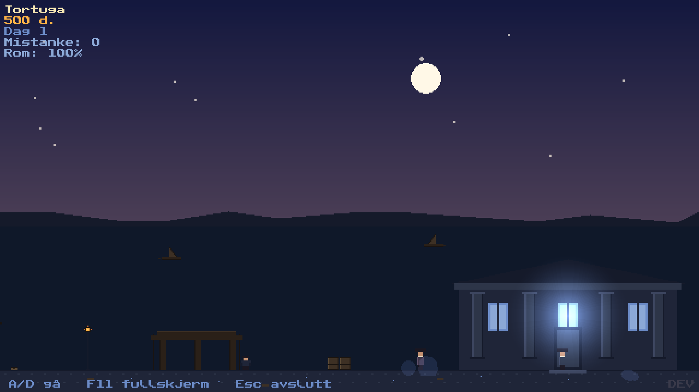

Se `PROSJEKT.md` for full designspesifikasjon, `ASSETS.md` for assets, og
`BENCHMARKS.md` for ytelsesmålinger per fase.

**Status:** Fase 3 spillbar (dialoger, rykter, mistanke, sabotasje, tilfeldige hendelser, score-overlay). Se `FASE_3.md` for pågående arbeid og `PHASE_2B_RETROSPECTIVE.md` / `PHASE_2A_RETROSPECTIVE.md` / `PHASE_1_RETROSPECTIVE.md` for tidligere faser.

## Krav

- Python 3.10+ (testet opp til 3.12)
- pygame-ce 2.5+ (IKKE vanlig `pygame` – Community Edition har API-er vi bruker, bl.a. `Surface.fblits()`)
- Plattformer:
  - **Linux** (primærmål: Mint 21.3 / Ubuntu 22.04+)
  - **macOS** 11 Big Sur eller nyere (Intel + Apple Silicon)
  - **Windows** 10/11

## Oppsett

Først: klon repoet og gå inn i mappa.

```bash
git clone https://github.com/Snkpipefish/pitch-and-plunder.git
cd pitch-and-plunder
```

### Linux (Ubuntu / Mint / Debian)

```bash
# Sørg for at python3-venv finnes (én gang per maskin)
sudo apt install python3 python3-venv python3-pip

python3 -m venv venv
source venv/bin/activate
pip install -r requirements.txt
```

### macOS

Anbefalt: installer Python via [Homebrew](https://brew.sh/) for å unngå systempythonen.

```bash
brew install python@3.12

python3 -m venv venv
source venv/bin/activate
pip install -r requirements.txt
```

Hvis du får en advarsel om at terminalen mangler tilgang til mikrofon/skjerm
(spillet bruker ingen av delene, men macOS spør noen ganger), godkjenn eller
ignorer — spillet trenger kun et grafisk vindu.

### Windows 10/11

Installer Python fra [python.org](https://www.python.org/downloads/windows/)
(huk av **"Add Python to PATH"** i installer'n).

Åpne **PowerShell** i prosjektmappa:

```powershell
py -m venv venv
venv\Scripts\Activate.ps1
pip install -r requirements.txt
```

Hvis PowerShell blokkerer aktiveringsskriptet (`...cannot be loaded because
running scripts is disabled...`):

```powershell
Set-ExecutionPolicy -Scope CurrentUser -ExecutionPolicy RemoteSigned
```

I **cmd.exe** bruker du i stedet:

```cmd
py -m venv venv
venv\Scripts\activate.bat
pip install -r requirements.txt
```

### Verifiser installasjonen (alle plattformer)

```bash
python -c "import pygame; print('CE:', hasattr(pygame, 'IS_CE'), pygame.version.ver)"
# Forventet: CE: True 2.5.x
```

Hvis pygame-importen krasjer med SIGILL eller lignende på gammel maskinvare:

```bash
pip install --upgrade --force-reinstall pygame-ce
```

## Kjøring

```bash
# Linux/macOS
source venv/bin/activate
python main.py

# Windows (PowerShell)
venv\Scripts\Activate.ps1
python main.py

# Windows (cmd)
venv\Scripts\activate.bat
python main.py
```

## Slik spiller du

Du er en pirat som har 100 dager på å gjøre Tortuga til din permanente
formuesbase. **Bare gullet du har lagret i Tortuga Gullkiste når dag 100
løper ut, teller som sluttsum** — gull i lommen, varer i lasten, eller
gull-cacher i andre havner blir igjen når seilet rives.

Du sjonglerer fire ting samtidig:

### 1. Børs-arbitrasje mellom fire havner

Tortuga, Port Royal, Havana og Nassau har hver sin børs som handler
sukker, rom, tobakk og bek. Prisene drifter uavhengig — kjøp billig i
én havn og selg dyrt i en annen. Hver havn har en strukturell skjevhet
(Port Royal: billig sukker, Havana: billig tobakk, Nassau: billig bek,
Tortuga: premium på alt).

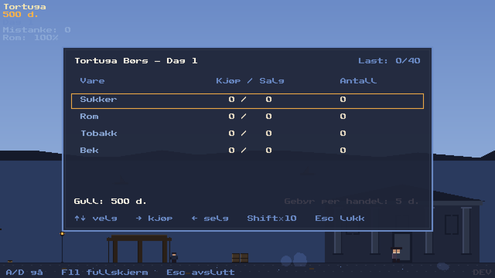

Markedet ticker hver daggry uavhengig av hvor du er. Trend-pilene
(↑→↓) er basert på de siste 3 dagene.

### 2. To havner, to ansikter

Tortuga er en falleferdig piratrede i tre; Port Royal er en britisk
kolonihavn i stein. Samme dag-natt-syklus, helt annen arkitektur og
folkelynne:

| Tortuga om dagen | Port Royal om dagen |
|:---:|:---:|
| 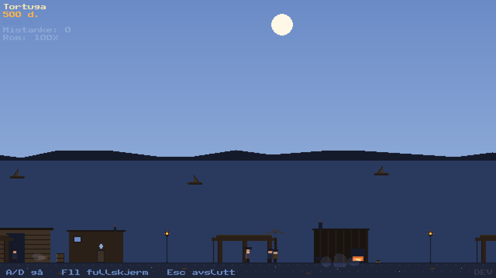 | 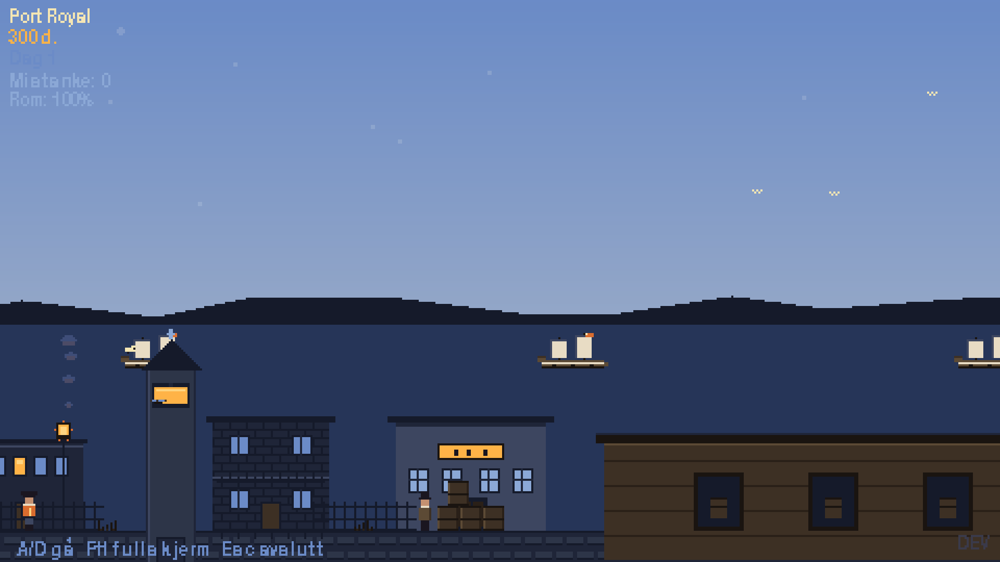 |
| **Tortuga om natten** *(hero-bildet over)* | **Port Royal om natten** |
|  | 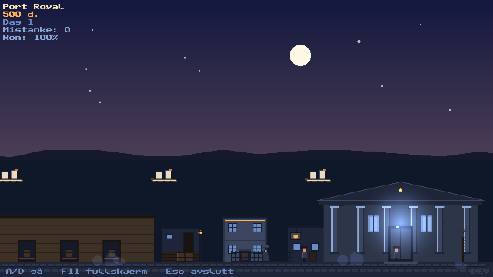 |

### 3. Tavernaen — to forskjellige menyer dag/natt

Trykk **E** ved tavernaen. Hva som er på menyen avhenger av tiden på
døgnet:

| Tavernaen om dagen | Tavernaen om natten |
|:---:|:---:|
| 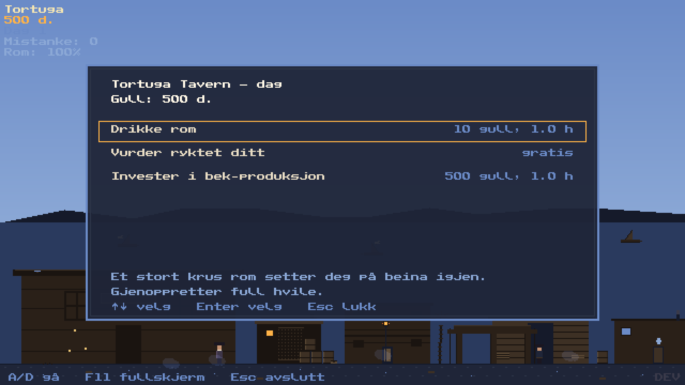 | 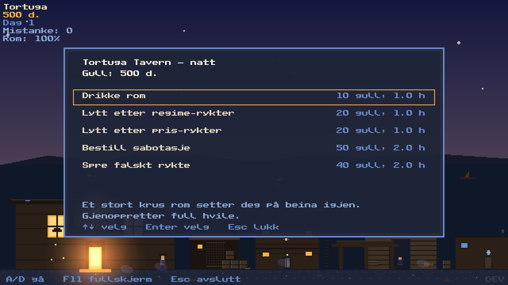 |

**Dagens hovedinvestering — bek-anlegget:** Kun i Tortuga, kun én gang
per spill. Koster 500 gull. Etter kjøp produserer Pitch Lake **2 bek
per dag passivt** (avgift 8 gull/dag i drift, stopper hvis du går
tom). Reiser du bort fra Tortuga akkumuleres bek på kaia og hentes
automatisk når du kommer tilbake.

**Nattens nyttige aktiviteter:** Lytt etter regime-rykter (les hva som
skjer på en annen havn før du seiler), bestill sabotasje mot en
konkurrent, eller spre falske rykter for å forskyve markedet til din
fordel. Mange av disse bygger mistanke (se under).

### 4. Reise — havnekontoret er fast-travel

Trykk **E** på havnekontoret for reisemenyen. Hver rute har en pris
(gull) og varighet (dager):

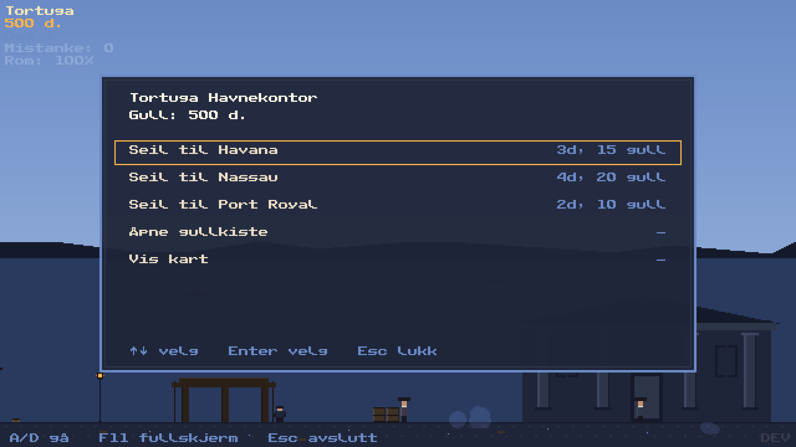

Under reise tikker klokken raskere (1¼ min per spilldag i stedet for
3 min i havn). Markedene i alle fire havner driver parallelt mens du
seiler, så bli ikke for lenge borte.

## Gull-cacher — hvorfor bare Tortuga teller

Hver havn har en gullkiste/cache du kan deponere og hente fra via
havnekontoret. Tortuga sin heter **"Gullkiste"** og er den eneste som
tells med i sluttsummen på dag 100:

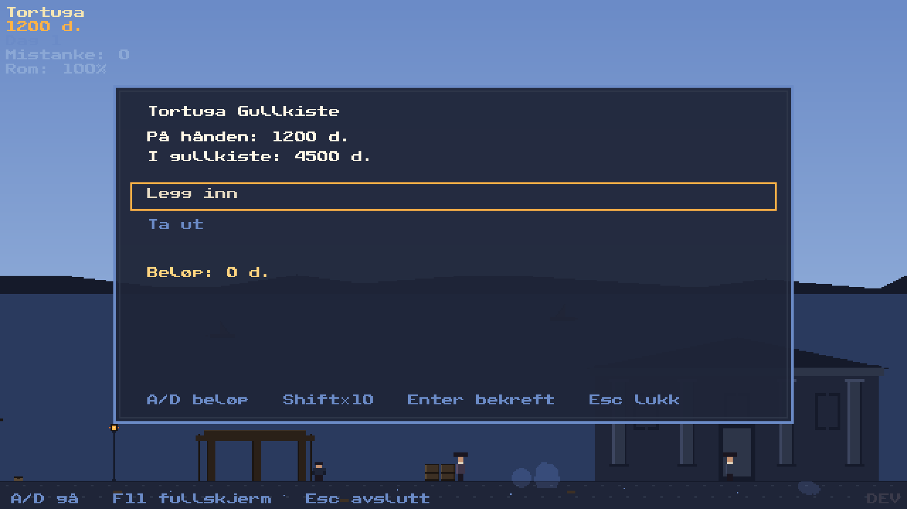

Cachene i Port Royal, Havana og Nassau fungerer som mellomlager — de
gjør at du slipper å frakte all kapital med deg på sjøen (hvor pirater
kan ta deler av lasta). Men gull du legger igjen utenfor Tortuga er
verdiløst når regnskapet skrives.

Strategien er derfor: tjen gjennom arbitrasje, transportér til Tortuga
gjennom mellomlager, og dump i Gullkista før dag 100.

## Mistanke og rykter

Sabotasje, falske rykter, misligheter med myndighetene bygger
**mistanke** (se HUD øverst venstre). Ved tilstrekkelig høy mistanke
risikerer du arrest — game over. Mistanke faller med ~1 per dag hvis
du oppfører deg respektabelt.

Du kan kjøpe **lytte-rykter** i tavernaen om natten. Trykk **R** når
som helst for å se aktive rykter med antall dager igjen før de
utløper:

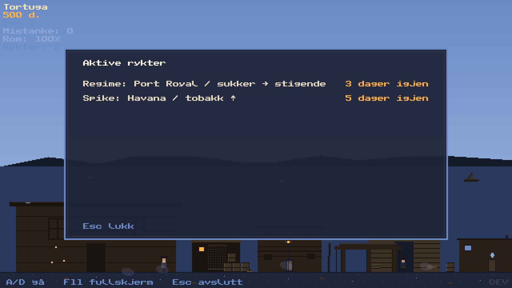

## Tilfeldige hendelser

Under reise og i havn kan det skje uventede ting — storm som forsinker
deg, pirater som tar 30 % av gullet, et heldig vrakfunn som gir 80
gull, eller verre ting (forlis kan bety død):

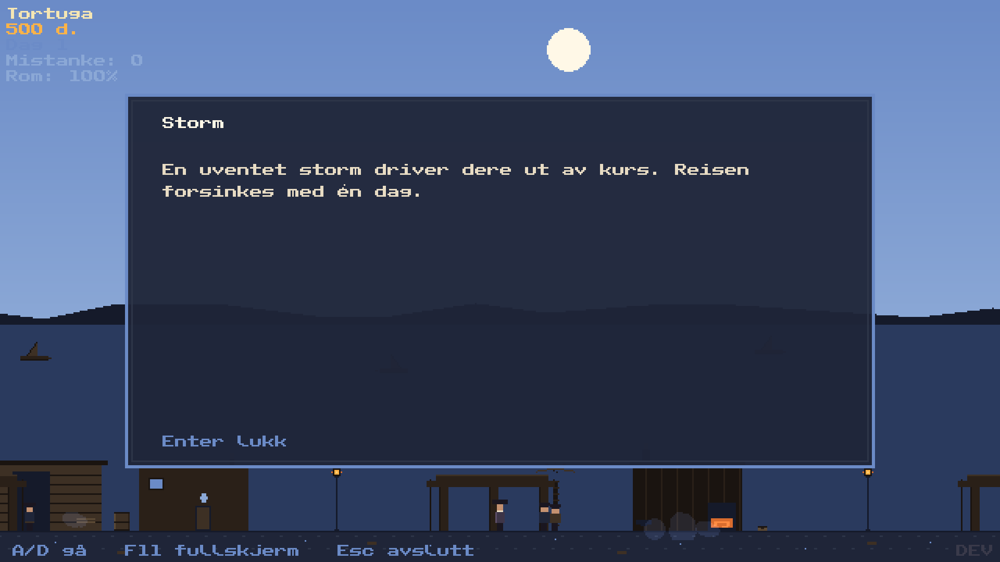

Trykk Enter/Space/ESC for å lukke event-meldinger.

## Kontroller

| Tast | Havn | Verdenskart | Reise-dialog | VoyageScene | Børs-overlay |
|------|------|-------------|--------------|-------------|--------------|
| A / ← | Gå venstre | Naviger vest | – | – | Selg 1 (Shift: 10) |
| D / → | Gå høyre | Naviger øst | – | – | Kjøp 1 (Shift: 10) |
| W / ↑ | – | Naviger nord | – | – | Velg vare opp |
| S / ↓ | – | Naviger sør | – | – | Velg vare ned |
| E | Åpne børs / kart / dialog (taverna, havnekontor) | Bekreft fokus / åpne reise-dialog | Bekreft reise | – | – |
| R | Åpne ryktedialog | – | – | – | – |
| ESC | Pause-meny | Tilbake til havn | Avbryt | – | Lukk overlay |
| Enter | Bekreft | – | – | – | – |
| F11 | Veksle fullskjerm | Veksle fullskjerm | – | Veksle fullskjerm | Veksle fullskjerm |

**Dev-mode** (krever `.devmode`-fil i prosjektrota eller `PITCH_DEV=1`):
| F1 | Teleport til Tortuga |
| F2 | Teleport til Port Royal |
| F3 | Teleport til Havana |
| F4 | Teleport til Nassau |
| F5 | Hot-reload `data/balance.json` |

Musen brukes ikke.

## Fase 1 – hva er inkludert

- **Landsby-scene** (Tortuga-gate, 1600 px bred verden)
  - 3-lags parallax (himmel + stjerner; gameplay med bygninger og gateplan; tom parallax-forgrunn)
  - Spiller-karakter med hatt-silhuett som vandrer med A/D
  - NPC Hawkins (statisk) foran Børshuset
  - Tavernaen til venstre (varmt lys bakt inn, 2 vinduer, skilt, åpen dør)
  - Børshuset til høyre (4 søyler, trekantgavl, 3 kalde vinduer)
- **Dynamisk lys** – 3 pre-rendrede radiale gradienter:
  - Svingende lanterne over tavernaens skilt
  - Varm døråpnings-glød ved tavernaen
  - Kald stødig glød fra Børshusets midtvindu
- **Tåke og ildfluer** – 4 + 4 partikler i object pool:
  - Tåke drifter over gata (kald, 30% metning)
  - Ildfluer klynger rundt tavernaen (additive, blinker)
- **Økonomi og børs** – 4 varer (sukker, rom, tobakk, bek) med kjøp/salg og 2% spread
- **HUD** øverst venstre: sted, gull (varm), dag (kald)
- **Save-system** med JSON-fil (`saves/savegame.json`), autosave ved QUIT, overlay-åpning/-lukking, scene-bytte

## Fase 2A – hva er lagt til

- **Dag-natt-syklus** (3 min reell tid per spilldag)
  - 6 pre-rendrede himmel-bakgrunner med cross-fade (midnatt, daggry starter, daggry fullført, midt på dag, solnedgang starter, solnedgang fullført)
  - Sol og måne som overlay i verdens-koordinater (1:1 kamera-offset)
    - Månen er statisk forankret over Børshuset (worldx 1350)
    - Solen beveger seg gjennom verden (worldx 1500 øst → 100 vest) med parabolsk y-bane som når horisonten ved sunrise og sunset
  - Fjell-silhuetter og hav okkluderer celestial ved horisont-passering
- **Markedsdybde**
  - Daglig prisoppdatering ved daggry (ikke kontinuerlig drift)
  - 3 regimer per vare (rising/stable/falling) med daglig rotasjons-sannsynlighet
  - Trend-pil i exchange (↑→↓) basert på siste 3 dager
  - Pris-historikk holder siste 14 dager
  - Pris clampet til [base×0.5, base×2.0]
- **Bek-produksjon via Pitch Lake**
  - Passiv 2 bek/dag ved daggry (avg_cost 0.00)
  - Daglig vedlikeholdskostnad 8 gull; stopper produksjon hvis gull < 8
  - HUD-linje viser "Bek: +2/dag (-8 d.)" eller "Bek: ingen drift"
- **Lagerbegrensning** – 40 enheter totalt i inventaret, kjøp blokkeres ved full last
- **Transaksjonsgebyr** – 5 gull flat per kjøp og salg
- **GameClock** – sentral dag-teller og sekunder-i-dag; `seconds_into_day` styrer alle dag-natt-rendringer og daglige events
- **Tester** – pytest-oppsett med 187 grønne tester (GameClock, DayCycle, Market, RegimeManager, PitchLake, save-migrering)
- **Toast-varsler** – generisk ui/toast.py-system (brukes for feilmeldinger ved utilstrekkelig gull)

Startgull: 300 (redusert fra 500 i Fase 1) for å matche den nye friksjonen.

## Fase 2B – hva er lagt til

- **Verdenskart-scene** (640×360 top-down, ingen panning, alle 4 havner synlige)
  - 4 havn-markører: Tortuga (Hispaniola), Port Royal (Jamaica), Havana (Cuba), Nassau (Bahamas)
  - Markør-tilstander: current (varm LANTERN-ring), focused (pulserende), other (kald STONE_LIT), aldri besøkt (dempet FOG)
  - Skip-ikon ved current-port (rent top-down, 4 retninger via 2 unike pre-renderinger + 2 symmetri-flips)
  - Pre-rendrede øy-silhuetter med topp-kant-belysning og horisont-bånd per VISUELL_REFERANSE §8
  - Havn-labels (Public Pixel 8px) i COLOR_MOON_HALO under hver markør
- **Tooltip for fokusert havn** med 4 tilstander:
  - Current: "Du er her" + ferske priser med trend-pil (↑→↓)
  - Fersk observed (≤5 dager): "sist besøkt Dag X (Y d. siden)" + priser med trend
  - Stale observed (>5 dager): rød dagsteller + grå priser + "?" trend
  - Aldri besøkt: "aldri besøkt", ingen pris-rader
- **Fire havner** med funksjonell børs i alle:
  - Per-havn `price_bias` × `base_price` gir strukturell karakter (Port Royal sukker billig, Havana tobakk billig, Nassau bek billig, Tortuga premium på alt)
  - Per-havn `regime_weights` (Markov-overgang sampling) gir tematisk volatilitet
  - Markedet i alle 4 havner tikker parallelt — 16 regime-decisions per dawn uansett hvor spilleren er
- **Aktiv seiling** mellom havner
  - Reise-bekreftelse-dialog viser "Tid: N dager / Kost: X gull"
  - Insufficient gull blokkerer med toast "Trenger X gull"
  - Akselerert klokke under reise (75 sek/dag at sea vs 180 i havn)
  - Skip beveger seg langs lineær bane fra avreise-havn til ankomst
  - Save/load mid-voyage gjenoppretter posisjon deterministisk fra clock-state
  - Avreise-toast ved fersk start ("Avreise mot Port Royal"); ikke ved resume
  - Ankomst-toast og automatisk observed-snapshot ved ankomst
- **Pitch Lake pending-units**
  - Når spilleren er borte fra Tortuga (under reise eller i annen havn): produksjon akkumuleres i `pending_units` (bekken lagres på kaia)
  - Ved ankomst Tortuga: `realize_pending_units` flytter pending → inventar opp til ledig kapasitet ("Hentet N bek fra kaia"-toast)
  - Upkeep trekkes uansett hvor spilleren er
- **Nested GameState v5**: PlayerState / WorldState / EconomyState / PitchLakeState. Migreringskjede fra v1-v4.
- **`data/balance.json` + `data/ports.json`**: alle økonomi-tall og havn-konfig flyttet ut av kode. Hot-reload via F5 i dev-mode.
- **Dev-mode**: `.devmode`-fil eller `PITCH_DEV=1` env-var aktiverer F1-F4 debug-teleport + F5 balance-reload + DEV-markør i HUD.
- **Tester**: 418 grønne (+231 gjennom 2B). Voyage-helpers, save-migrering, marker-states, tooltip-rendering, dialog-flow, gull-trekking — alt dekket.

## Benchmark

```bash
python benchmark.py                              # village-scene, 10 s
python benchmark.py --open-exchange              # village med børs åpen
python benchmark.py --scene world_map            # verdenskart-scene
python benchmark.py --scene voyage               # voyage-scene (auto-bootstrap reise)
python benchmark.py --scene parallax_test        # kun parallax + kamera
python benchmark.py --duration 30                # lengre måling
```

Resultater loggføres i `BENCHMARKS.md`. Målet er **≥30 FPS stabilt** på
Intel Pentium T4200 / GM45.

Benchmark-prosessen monkey-patcher `save_module.save` til no-op før
scene-init, slik at `--open-exchange` (som ellers ville trigget
autosave) ikke kan overskrive `saves/savegame.json` med fersk
GameState()-default. Lagt til etter en C7c-patch-2-bug.

| Fase | Lukket | Overlay | Verdenskart | Voyage |
|------|--------|---------|-------------|--------|
| Fase 1-slutt | 2.81 ms | 3.90 ms | – | – |
| Fase 2A-slutt | 4.61 ms | 6.15 ms | – | – |
| Fase 2B-slutt | 4.87 ms | 6.29 ms | 1.21 ms | 1.25 ms |

Akkumulert 2B-regresjon (+0.26 ms lukket, +0.14 ms overlay) er
moderat. Verdenskart og voyage leverer 4× headroom mot hard grense
(10 ms). Se `PHASE_2B_RETROSPECTIVE.md` for per-commit-historikk.

## Prosjektstruktur

Se `PROSJEKT.md` seksjon 4. Kort fortalt:

- `main.py` – entry point, scene manager, save-loading, dev-mode F5/F1-F4
- `benchmark.py` – ytelsestest med cProfile, autosave-disabled for safety
- `constants.py` – palett, taster, ytelseskonstanter, SDL env vars
- `config/` – `port_config.py` (PortConfig dataclass + ports.json-loader)
- `scenes/` – `port_village`, `port_village_renderer`, `port_buildings`, `exchange`, `world_map`, `world_map_builder`, `voyage`, `parallax_backdrops`, `parallax_test`, `base_scene`
- `systems/` – `balance`, `dev_mode`, `economy`, `save`, `game_clock`, `day_cycle`, `pitch_lake`, `regime_manager`, `voyage`, `parallax`, `lighting`, `particles`, `debug_teleport`
- `state/` – `game_state` (v5 nested), `player_state`, `world_state`, `economy_state`, `pitch_lake_state`, `ship_state`, `voyage_state`, `market_state`, `observed_price`
- `entities/` – `player`, `npc`, `commodity`, `celestial`, `port_marker`, `ship_icon`
- `ui/` – `hud`, `hint`, `toast`, `color_palette`, `world_map_tooltip`
- `tests/` – pytest-tester (418 grønne per Fase 2B-slutt)
- `assets/fonts/` – Public Pixel (CC0)
- `data/` – JSON-data (`commodities.json`, `npcs.json`, `balance.json`, `ports.json`)
- `saves/` – spillerens lagring (i .gitignore)

## Lisens

Koden: eget prosjekt. Tredjepart-assets: se `CREDITS.md`.
